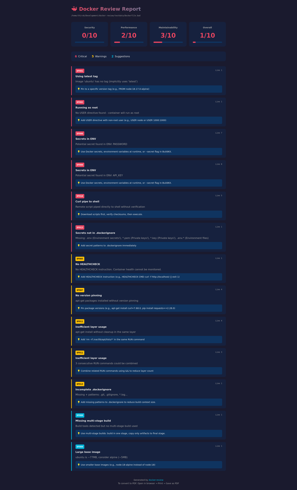

# Docker Review

A fast, offline-first CLI tool that reviews Docker configurations like a Senior DevOps Engineer. It detects performance issues, security vulnerabilities, and maintainability problems, providing actionable suggestions and impact estimates.

**Single binary** - No runtime dependencies, ~3MB. Easy CI/CD integration!

## Features

- **Dockerfile Analysis** - 13 rules (DF001-DF013)
- **Docker Compose Analysis** - 11 security-focused rules (DC001-DC011)
- **Scoring System** - Security, Performance, Maintainability scores (0-10)
- **Auto-Fix** - Automatically optimize Dockerfiles with `--fix`
- **ML Stack Detection** - Suggests optimized images for TensorFlow, PyTorch, etc.
- **Multiple Output Formats** - Terminal, JSON, SARIF (GitHub), HTML
- **Ignore Comments** - Suppress specific warnings inline
- **CI/CD Ready** - Exit codes, `--fail-on` flag

## Installation

### Quick Install (Linux/macOS)

```bash
curl -fsSL https://raw.githubusercontent.com/thirukguru/docker-review/main/install.sh | bash
```

### From Source

```bash
git clone https://github.com/thirukguru/docker-review.git
cd docker-review
make build
sudo cp docker-review /usr/local/bin/
```

### From Releases

Download binary from [Releases](https://github.com/thirukguru/docker-review/releases).

## Usage

### Basic Analysis

```bash
docker-review analyze Dockerfile
docker-review analyze docker-compose.yml
docker-review analyze ./path/to/project
```

### Output Formats

```bash
# Terminal (default)
docker-review analyze Dockerfile

# JSON
docker-review analyze Dockerfile --json

# SARIF (GitHub Code Scanning)
docker-review analyze Dockerfile --sarif > results.sarif

# HTML Report
docker-review analyze Dockerfile --html -o report.html
```

### Auto-Fix Dockerfiles

```bash
docker-review analyze Dockerfile --fix
docker-review analyze Dockerfile --fix --fix-output Dockerfile.optimized
docker-review analyze Dockerfile --fix --diff
```

### CI Mode

```bash
docker-review analyze Dockerfile --ci --fail-on critical
docker-review analyze Dockerfile --ci --fail-on warning
```

### Ignore Specific Rules

Add comments in your Dockerfile:

```dockerfile
# docker-review:ignore DF001
FROM ubuntu:latest

# docker-review:ignore DF002 DF003
RUN apt-get update

# docker-review:ignore all
COPY . /app
```

### Other Commands

```bash
docker-review rules          # List all rules
docker-review explain DF001  # Explain a specific rule
docker-review version        # Show version
```

## Rules

### Dockerfile Rules (DF001-DF013)

| ID | Name | Severity |
|----|------|----------|
| DF001 | Using latest tag | Critical |
| DF002 | Running as root | Critical |
| DF003 | No .dockerignore | Warning |
| DF004 | Bad layer ordering | Warning |
| DF005 | No HEALTHCHECK | Warning |
| DF006 | Secrets in ENV | Critical |
| DF007 | No version pinning | Warning |
| DF008 | Missing multi-stage build | Suggestion |
| DF009 | Large base image | Suggestion |
| DF010 | Curl pipe to shell | Critical |
| DF011 | Inefficient layer usage | Warning |
| DF012 | ML stack optimization | Suggestion |
| DF013 | Incomplete .dockerignore | Warning |

### Docker Compose Rules (DC001-DC011)

| ID | Name | Severity |
|----|------|----------|
| DC001 | No restart policy | Warning |
| DC002 | Privileged container | Critical |
| DC003 | No resource limits | Warning |
| DC004 | Using latest tag | Critical |
| DC005 | Hardcoded secrets | Critical |
| DC006 | Docker socket mount | Critical |
| DC007 | Host network mode | Critical |
| DC008 | Dangerous volume mount | Critical |
| DC009 | Capability additions | Warning |
| DC010 | Database port exposed | Warning |
| DC011 | Port bound to all interfaces | Suggestion |

## Example Output

```
Docker Review Report
File: Dockerfile

📊 Scores
  Security:       ░░░░░░░░░░ 0/10
  Performance:    ██░░░░░░░░ 2/10
  Maintainability:███░░░░░░░ 3/10
  Overall:        █░░░░░░░░░ 1/10

📋 Issues Summary
  5 Critical, 5 Warnings, 2 Suggestions

✗ Critical Issues
  [DF001] Using latest tag :1
    Image 'ubuntu' has no tag (implicitly uses 'latest')

💡 Suggestions
  [DF012] ML stack optimization :3
    TensorFlow detected: Consider tensorflow/tensorflow:gpu
```

## Sample Reports

### HTML Report

Generate beautiful HTML reports with `--html`:



```bash
docker-review analyze Dockerfile --html -o report.html
# Open in browser → Print → Save as PDF
```

## CI/CD Integration

### GitHub Actions

```yaml
- name: Analyze Dockerfile
  run: |
    curl -fsSL https://raw.githubusercontent.com/thirukguru/docker-review/main/install.sh | bash
    docker-review analyze . --ci --fail-on critical

# With SARIF upload for Code Scanning
- name: Run docker-review
  run: |
    docker-review analyze Dockerfile --sarif > results.sarif
- uses: github/codeql-action/upload-sarif@v2
  with:
    sarif_file: results.sarif
```

### GitLab CI

```yaml
docker-review:
  script:
    - curl -fsSL https://raw.githubusercontent.com/thirukguru/docker-review/main/install.sh | bash
    - docker-review analyze . --ci --fail-on critical
```

## vs Hadolint

| Feature | Hadolint | docker-review |
|---------|----------|---------------|
| Dockerfile rules | 100+ | 13 |
| Docker Compose | ❌ | ✅ 11 rules |
| Auto-fix | ❌ | ✅ |
| ML optimization | ❌ | ✅ |
| .dockerignore analysis | ❌ | ✅ |
| SARIF output | ✅ | ✅ |
| HTML report | ❌ | ✅ |
| Scoring system | ❌ | ✅ |

**Use both!** Hadolint for deep Dockerfile linting, docker-review for Compose + security + auto-fix.

## License

MIT
